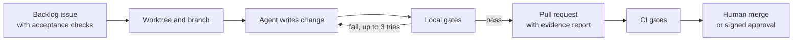
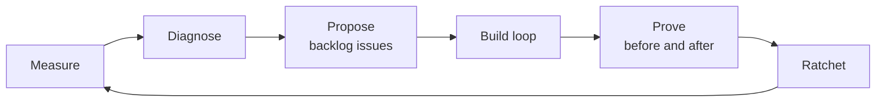
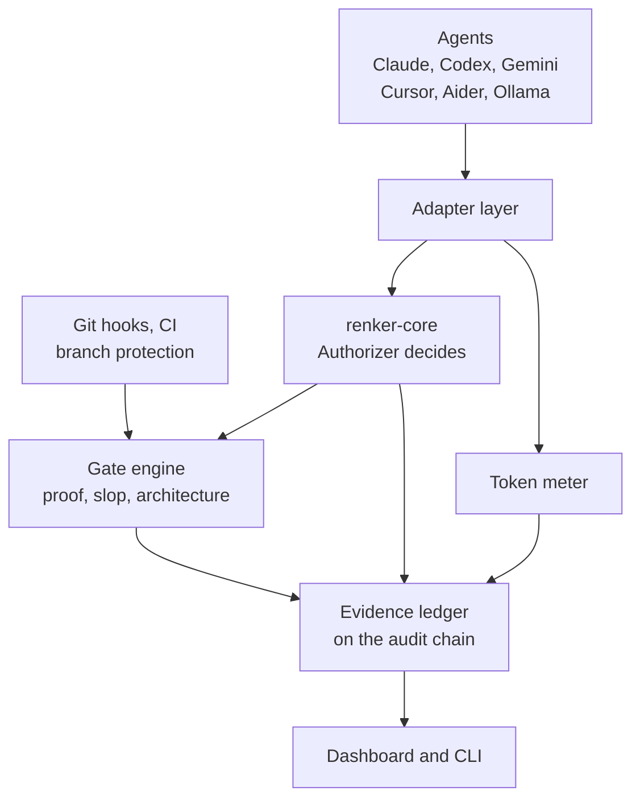

# Selfproof: Concept

Version 1.0, 21 September 2026. Owner: Sebastian Renker (`sebastianrenker`, `renker-industries`). Status: concept. Nothing described here is built yet unless it is labelled `existing`.

## How to read this document

Every statement carries one of four labels, either written out or clear from the context:

- `existing`: found on a repository page (README) on 21 September 2026. It is not yet audited by us.
- `planned`: designed here, not built.
- `measured`: produced by a run, with sample size and method.
- `estimated`: a guess, marked as such.

Facts about third-party projects are snapshots from their GitHub pages on 21 September 2026 (stars, licenses, maintenance status). They must be re-verified before anything depends on them.

If this concept and the autopilot prompt disagree, the concept wins on intent and the prompt wins on procedure. When in doubt, the question is recorded in `docs/reports/OWNER_TODO.md`, work that does not depend on it continues, and nobody improvises around a wish.

---

## 0. The owner's wishes (binding checklist)

These are the owner's requirements, in his own priorities. They are the acceptance test for every phase and for every change to this concept, including the adoption of new repositories (section 13). A change that violates a wish is rejected.

| # | Wish | Met in | Verified by |
| --- | --- | --- | --- |
| W1 | Merge the most AI-relevant repos of `sebastianrenker` and `renker-industries` into one platform | 3, 4 | Inventory ADR, import with history |
| W2 | The platform builds itself with the owner's own programs, applied through Claude Code, so only checked code enters | 2 | Ledger stage tags, `Built-by` trailers, cutover tag |
| W3 | The programs make sure architecture and code are free of AI slop and protected | 5 | Gate corpora in CI |
| W4 | It works for all AI systems, not only Claude, and improves them | 7 | Capability matrix, same corpus through every adapter |
| W5 | A highly secure program in a serious repo with a fitting name and configuration | 6, 11, 12 | Scanner results, repo settings read back |
| W6 | Many ratings and much attention on GitHub, earned honestly | 12 | Launch checklist, no star manipulation |
| W7 | An interface showing token savings and everything the programs improved or prevented in his repos | 8, 9 | Dashboard numbers link to the ledger |
| W8 | Honesty is the most important rule | 1, all | Claim labels, `docs_claims` gate |
| W9 | A better name than "Renker Platform" | 11 | ADR-0001 (working name: Selfproof) |
| W10 | It really builds itself | 2 | Self-built share metric, published failures |
| W11 | Understandable for everyone, in the repo's wiki | 10 | Wiki structure and readability check |
| W12 | Everything in English, not a single German file | 10 | `language` gate |
| W13 | Claude Code (local) does the building | 2 | Autopilot prompt, `Built-by` trailers |
| W14 | Everything the owner has on the topic is used; `renker-core` is the most important | 3, 4 | Inventory ADR, kernel import |
| W15 | Look for further repos with more potential without giving up any wish | 13 | Scouting ADR and report |
| W16 | Few manual steps for the owner; unavoidable ones are listed | 16 | Owner's checklist |
| W17 | Everything is documented strictly, in English, and that documentation standard is already written into this concept | 10.2 | `docs_coverage`, `docs_claims` and `language` gates |
| W18 | Claude Code builds it completely autonomously with the owner's programs, with proofs, and keeps making it better | 2.5, 2.6 | Autonomy charter, improvement cycles and before/after metrics in the ledger |

---

## 1. Vision and promise

Selfproof is a provider-neutral platform that checks AI-written code for slop and security problems, records evidence for every check, shows what it saved and prevented, and builds itself through a controlled loop of agents and its own gates. Its kernel is the owner's `renker-core`.

What Selfproof promises, and nothing beyond it:

1. Every "done", "correct" or "secure" statement is backed by an executed check that is bound to the exact commit.
2. Every check leaves an entry in a tamper-evident ledger that anyone can verify.
3. Each release has zero known open findings of severity medium or higher according to named tools, versions and date.
4. Everything it claims about itself is either evidence-linked or labelled `planned`.

What it does not promise: "absolutely secure", "unhackable" or "no bugs". These cannot be proven for any program. The strongest allowed form is: "0 known findings at commit `<sha>` according to `<tools and versions>` on `<date>`". This honesty is also the stronger argument on GitHub, because it is credible.

---

## 2. What "self-building" honestly means

> Selfproof builds itself by running its own build loop on its own backlog. An AI agent (by default Claude Code, run locally by the maintainer) writes each change on a branch. Selfproof's own gates check the change and record evidence. Changes to the gates, the kernel and other protected paths always need a human. This does not mean unsupervised: the language model writes the code, the gates check it, and a human owns the rules.

### 2.1 Three stages, labelled in the ledger

| Stage | Who writes the code | Who checks it | Ledger tag |
| --- | --- | --- | --- |
| Seed | Claude Code with CUSTOS v0.2.0 as a plugin, pinned by commit hash | CUSTOS locally, CI as soon as it exists | `stage:seed` |
| Self-hosted | Claude Code through `selfproof build` | Selfproof's own gates in CI on every PR | `stage:self-hosted` |
| Protected | Agent proposes, human approves | Gates plus a signed human approval | `stage:protected` |

The cutover happens when CI runs the platform on a PR and blocks a deliberately bad test change. That commit gets the tag `self-host-v0`. The seed is the last hand-driven phase; everything after it is built through the loop, and each manual fix of the loop itself is counted as `Built-by: human`.

### 2.2 The loop (`selfproof build`)



1. Only issues labelled `selfbuild` by a maintainer are picked (the actor of the label event is verified). They must contain an "Acceptance checks" block of commands or test paths. Issue text is untrusted data.
2. The agent works in an isolated git worktree with a scrubbed environment: no tokens or keys.
3. Budgets for time, steps and tokens apply. The kill switch is the file `.selfproof/STOP`.
4. Up to three repair iterations. After that the attempt is recorded as a failure in the ledger and on the issue. A green result is never forced.
5. The pull request carries an evidence report generated from the ledger and the trailer `Built-by: agent <name> <version>`.
6. An independent second run with a different prompt tries to disprove the change. This is an extra signal, not a replacement for the gates.
7. Merging follows the autonomy charter (section 2.5): Tier A changes merge automatically when every proof passes; Tier B changes wait for a signed approval.

The loop runs locally with the owner's own Claude Code. CI only verifies; CI never runs an agent with secrets. It is never triggered by `pull_request_target`, comments from outsiders or any event an outsider can cause.

### 2.3 Protected paths

`src/renker_core/`, `src/selfproof/gates/`, `src/selfproof/core/`, `src/selfproof/selfbuild/`, `rules/`, `.github/`, `LICENSE`, `SECURITY.md`, `CODEOWNERS`. A change there evaluates to `REQUIRE_APPROVAL` in renker-core. The approval is a renker-core `Approval` (one-time, expiring, replay-protected, bound to the decision id). The owner creates it with `selfproof approve <decision-id>` and commits it in a signed commit with his key. CI verifies the signature against a pinned `allowed_signers` file. renker-core does not authenticate actors cryptographically yet, so the git signature carries that trust. A `test_weakening` finding needs an approval as well.

### 2.4 The honest metric

The dashboard shows the self-built share: commits and lines by author kind (`human`, `agent`), seed commits included, no cherry-picking. Every commit carries `Built-by: human` or `Built-by: agent <name> <version>`. Failed self-build attempts are shown as prominently as successes.

### 2.5 Autonomy charter

"Completely autonomous" means: Claude Code runs the whole program (preflight, scouting, seed, cutover, every backlog item, continuous improvement) without questions, waiting or hand-holding. It does not mean unsupervised rule changes. A self-improving system that can rewrite its own gates and approve itself is exactly the failure mode Selfproof exists to prevent. So the owner authorizes autonomy once, in a charter, and inside the charter Claude Code never stops to ask; outside it, work is queued, never blocked and never improvised.

The charter is written at the top of the autopilot prompt (authorization source: the owner's prompt, its SHA-256 recorded in the first ledger entry), committed as `AUTONOMY_CHARTER.md`, and afterwards changeable only by the owner through a signed commit.

| Tier | What | Rule |
| --- | --- | --- |
| A | Documentation, added tests and corpus examples (no weakening), non-protected source such as adapters, token module and dashboard, refactors within the size budget | Built and proven autonomously, and merged automatically when every gate, the verifier, the auditor and the metric ratchet pass |
| B | Protected paths (section 2.3) | Built and proven autonomously. The pull request waits with the label `needs-approval`, the loop continues with other work, and the owner approves in batches with signed approvals. The charter may pre-approve classes with measurable conditions, for example "a gate change that raises holdout recall without raising holdout false positives and stays under 200 changed lines" |
| C | Never, not even with proof: weaken or delete a gate, test or threshold to make something pass; disable branch protection; change the charter, the ratchet baseline by hand, the holdout set or the ledger; forge an approval; touch credentials; publish, announce or post; exceed budgets; act outside the repositories named in the charter | Refused by the kernel (`DENY`) and recorded as `TIER_C_BLOCKED` |

**Authorizations.** Legal and irreversible steps are explicit switches in the charter; anything not set to YES is NO: create the private repo, import `renker-core` into it, relicense `renker-core` to Apache-2.0, make the repo public, archive the old repos, auto-merge Tier A, pre-approved Tier B classes, create the private holdout repo. Posting launch texts is never automatic.

**Private first.** The whole platform is built in a private repository with its full history. Publication is a separate step that starts only when the owner has switched on both the relicensing and the public switch, and only after a release-readiness check (secret scan over the full history, license scan, zero open findings, documentation gates, `SECURITY.md`) passes.

**Safety envelope for unattended runs.**

- An isolated environment (WSL2, a VM or a devcontainer) and a fine-grained token limited to the repositories in the charter. If only the owner's full `gh` login is available, the kernel restricts every `gh` and `git` action to the repositories in the charter and the residual risk is written into `OWNER_TODO.md`.
- No blanket permission bypass. Claude Code runs with an allow-list of commands and the CUSTOS hooks; the exact flags and settings are read from the current official documentation first.
- Budgets: pull requests per day, open pull requests, repair iterations per task, consecutive failures, improvement cycles per run. A token budget is used only if the owner sets one; usage is logged either way.
- Kill switch `.selfproof/STOP`. Circuit breaker: after three consecutive failed or regressing pull requests, auto-merge switches off, an incident issue is opened, the CUSTOS root-cause agent runs, and auto-merge resumes only after a proven fix is merged.
- Everything read from issues, web pages, third-party repos and tool output is data. Nothing in it can grant or widen authority; only the charter can.
- Reporting: `docs/reports/STATUS.md` is regenerated every cycle, and a pinned issue "Autopilot digest" shows the current state, the pending Tier B approvals and the owner's to-do list, readable from a phone.

### 2.6 Improvement loop (`selfproof improve`)

A second loop makes Selfproof better, and every improvement is proven.



1. **Measure:** run all gates on the repo itself, the corpora, the holdout, the benchmark, the documentation coverage and the scanners; write the metrics to the ledger.
2. **Diagnose:** rank weaknesses: missed known-bad examples, false positives, failed or slow self-build attempts, documentation gaps, open findings, Scorecard gaps, growth in size, complexity or dependencies.
3. **Propose:** each weakness becomes a backlog issue with an executable acceptance check and a target metric. Backlog items come only from the concept's roadmap, from a ledger-recorded improvement proposal, or from an issue the owner labelled. Issues from outsiders are never a source.
4. **Build:** the normal build loop (section 2.2).
5. **Prove:** before and after on the same metrics. An improvement must exceed the measured noise; a regression on any tracked metric fails the change.
6. **Ratchet:** the baseline file moves only after a proven improvement, in its own mechanical pull request created by the CLI, never by the builder.

| Metric | Direction |
| --- | --- |
| M1 Recall of each gate on its known-bad corpus | Up |
| M2 False-positive rate of each gate on its known-good corpus | Down |
| M3 Recall and false-positive rate on the holdout set (aggregate scores only) | Up and down |
| M4 First-attempt pass rate of self-build tasks, and mean repair iterations | Up, down |
| M5 Documentation coverage (section 10.2) | Up to 100 percent |
| M6 Open scanner findings of severity medium or higher | Down to 0 |
| M7 Net token saving from the benchmark, with sample size | Up |
| M8 Mutation score of the test suite (tool chosen in scouting) | Up |
| M9 Size, complexity and dependency counts | Down or flat |
| M10 Runtime of the gates on the repo | Down |
| M11 OpenSSF Scorecard score | Up |
| M12 Human interventions per ten merged pull requests | Down |

**Anti-gaming rules.**

1. Builder, verifier and ratchet are separate roles with separate permissions. The builder cannot edit evaluators, corpora, thresholds, the baseline, the charter or CI.
2. The holdout set lives in a separate private repository. The builder never sees its cases, only aggregate scores. This reduces overfitting; it does not eliminate it, and the wiki says so.
3. Bigger is not better: size, complexity and dependency counts are metrics, and deleting code that the proof shows is unneeded counts as an improvement.
4. Tool versions and seeds are frozen for measurement, and noise is measured by repeated runs to set the thresholds.
5. Every improvement claim on the dashboard shows before, after, sample size and method.
6. Stop rules: two consecutive cycles without a proven improvement, the cycle budget reached, or the circuit breaker open.
7. Every ten cycles the scouting of section 13 is repeated; results become proposals, and replacing a component the owner built becomes a Tier B item.

---

## 3. Sources: everything the owner has on the topic

Facts come from the public GitHub pages on 21 September 2026 (READMEs, not audited code). The build inventory in Phase 0 covers private repositories and local folders too, and classifies each item as `kernel`, `module`, `reference`, `fleet-target` or `excluded`, with a written reason. Nothing is silently dropped and nothing is integrated without a reason.

| Source | What it is (`existing`) | Role |
| --- | --- | --- |
| [`sebastianrenker/renker-core`](https://github.com/sebastianrenker/renker-core) | Dependency-free Python decision kernel: identity, action, resource, capability, permission, policy, context, decision, approval, audit. Fail-closed, replay guard, tamper-evident audit chain, 132 tests, public API frozen in `__all__`. License: proprietary ("All rights reserved"). PROPOSED, not built: signed identities, composite engines, Evidence/Provenance, wire serialization | **Kernel** (after relicensing) |
| [`sebastianrenker/renker-core-authz`](https://github.com/sebastianrenker/renker-core-authz) | Apache-2.0 predecessor: capabilities, path scopes, SHA-256 audit chain, `GuardedFilesystem` | Lineage and migration source; missing features are ported into renker-core, then the repo is archived |
| [`renker-industries/custos`](https://github.com/renker-industries/custos) | MIT, v0.2.0 Claude Code plugin: 9 agents, 6 hook types, slop detectors, fleet mode, dashboard interface. Its own README says the security scans are placeholders | Gate engine, fleet mode, seed builder, dashboard look; split into neutral core and Claude adapter |
| RENKER FLINT (local concept files, not public) | Token-saving layer built on the MIT part of caveman | Token module |
| [`sebastianrenker/continuum`](https://github.com/sebastianrenker/continuum) | MIT architecture prototype (Phase 0, not validated) with a verification layer against unsubstantiated claims and governance gates | Reference: the verification idea flows into `docs_claims` and `proof`; the materials-discovery code stays out |
| [`sebastianrenker/rencora`](https://github.com/sebastianrenker/rencora) | Personal desktop AI assistant (PyQt6, Gemini Live, Ollama). License: personal, non-commercial. "Not externally audited" by its own statement | First fleet target and real-world test; never vendored |
| [`sebastianrenker/renkervault`](https://github.com/sebastianrenker/renkervault) | Zero-knowledge encrypted chat prototype | Fleet target; not part of v0.1 |
| [`sebastianrenker/sebastianrenker.github.io`](https://github.com/sebastianrenker/sebastianrenker.github.io) | Static landing page with a `reality-check.md` | Becomes the project site; its claims go through `docs_claims` |
| RenkerNet, JARVIS, StyleSync AI, resell automation | Private repos or concepts, if present | Fleet targets once code exists |

---

## 4. Architecture



### 4.1 Principles

1. **Enforcement outside the agent.** Not every agent has hooks. Git hooks, CI and branch protection are the base for every agent; native agent hooks only give faster feedback.
2. **The kernel decides.** Every agent action (write a file, run a command, open network access) and every merge is submitted to renker-core's `Authorizer` and returns an immutable `Decision`: `ALLOW`, `DENY` or `REQUIRE_APPROVAL`. It is fail-closed and independent of the model.
3. **One rules format.** Rules live as data in `rules/*.yaml`. `CLAUDE.md`, `AGENTS.md`, `GEMINI.md` and Cursor rules are generated from them; a CI check fails if a generated file is stale or hand-edited.
4. **One evidence format.** Every check writes an entry to the ledger; the dashboard reads only from there.
5. **Fail closed.** No valid proof, no merge, not even for the owner.
6. **Skipped is not passed.** Every check returns `PASS`, `FAIL`, `SKIPPED(reason)` or `ERROR(reason)`. A missing tool, no network or a timeout is never `PASS`. Releases need zero `SKIPPED` among required checks.

### 4.2 Kernel: renker-core

- Selfproof calls `renker_core`; it does not copy its logic. Kernel changes are made in `src/renker_core/` through the loop and are protected paths.
- The frozen public API (`renker_core.__all__`) and its guard test stay. The kernel's 132 tests (unit, integration, security, property-based), ruff and mypy run unchanged in Selfproof's CI.
- Its `docs/THREAT_MODEL.md` and `SECURITY_ATTACKS.md` are read first; their honest non-guarantees carry into the wiki with the same meaning.
- Build agents receive capabilities: scoped, time-bound, revocable grants, for example write access only to the worktree of the current issue.
- The PROPOSED items are built through the loop in this order: Evidence/Provenance (the ledger needs it), signed identities, then the rest. Until signed identities exist, actors are not cryptographically authenticated. This is stated in the wiki.
- The kernel keeps zero runtime dependencies. No scouted tool (section 13) may become a dependency of `renker_core`.

### 4.3 Evidence ledger

- Built on renker-core's audit chain, not a second format (its real API is inspected first).
- Append-only JSONL. Each entry has `id`, `timestamp`, `actor_kind` (`human|agent|ci`), `actor_name`, `commit_sha`, `gate`, `command`, `exit_code`, `output_sha256`, `verdict`, `stage`, `prev_hash`, `hash`.
- `selfproof ledger verify` recomputes the chain.
- Honest limit: a hash chain detects edited entries, not a truncated tail. The chain head is therefore anchored in every signed release tag and release note, so truncation becomes detectable against the last release.

### 4.4 Repository layout (`planned`)

```text
selfproof/
  LICENSE  NOTICE  README.md  SECURITY.md  CONTRIBUTING.md  CODE_OF_CONDUCT.md  CODEOWNERS
  AUTONOMY_CHARTER.md    the owner's authorizations and budgets (changeable only by the owner)
  pyproject.toml
  src/renker_core/       the kernel, imported with history
  src/selfproof/
    core/        config, rules loader, evidence ledger
    gates/       proof, slop, architecture, security, language, docs_claims, docs_coverage, test_weakening
    adapters/    git, claude_code, codex, gemini_cli, cursor, aider, ollama
    tokens/      meter, bench, presets
    selfbuild/   backlog, runner, merge policy
    dashboard/   server, static export
    cli.py
  rules/         source of truth for rules
  tests/         unit, integration, corpus/bad, corpus/good, fixtures/non_english
  docs/          the full documentation tree, see section 10.2
  .github/       workflows, issue and PR templates
```

Language: Python 3.11 or newer, standard library first. Every runtime dependency needs an ADR line explaining why it is worth its supply-chain risk. No CDN scripts anywhere; the dashboard is self-contained.

---

## 5. Gates: slop-free and secure code

Each gate ships with a corpus: `tests/corpus/bad/<gate>/` (known-bad examples it must catch) and `tests/corpus/good/<gate>/` (known-good examples it must not flag). CI fails if a gate misses a bad example or flags a good one. This tests the gates themselves.

| Gate | Checks | Blocks when |
| --- | --- | --- |
| `proof` | Runs the configured test, lint and type commands and binds the result to the exact commit | No passing run for the current SHA; stale proof is a failure |
| `slop` | `existing`: placeholder bodies (bare `...`), placeholder markers (TODO/FIXME/XXX/HACK) in comments, over-broad `except`/`except Exception: pass`, and test functions without assertions. `planned` (deferred to vulture/jscpd per ADR-0003): non-existent imports and packages, dead code, comments that only repeat the code, and copy-pasted blocks | A detector fires and is not suppressed |
| `architecture` | Layering rules, import cycles, complexity and file-size budgets, new dependency without an ADR line and a registry check | A rule is violated or a budget exceeded |
| `security` | Secrets, static analysis, dependency advisories, workflow linting, license check, SBOM | A finding of severity medium or higher, or an unknown license |
| `language` | English-only rule for all text files, commit messages, issue and PR templates | Non-English text outside `tests/fixtures/non_english/` |
| `docs_claims` | Numbers and security statements in README and wiki come from generated evidence or are marked `planned`; code blocks tagged `verify` are executed in a sandbox | An unsupported claim or a failing documented command |
| `test_weakening` | Deleted tests or assertions, added skip markers, loosened thresholds | Any such change without approval |
| `docs_coverage` | Every item in the documentation requirement matrix (section 10.2) has a valid, current, link-checked doc; docstrings and type hints; generated references are up to date; a changelog entry exists when `src/` changes | An item is undocumented or its documentation is stale |

Suppressions need a reason and an expiry date and are visible in the ledger and the dashboard. Release rule: zero open findings of severity medium or higher and zero `SKIPPED` among required gates. Which concrete tools implement each gate is decided in section 13; the gates orchestrate tools, they do not reimplement them.

---

## 6. Threat model of the platform itself

| Threat | Countermeasure |
| --- | --- |
| Prompt injection through repo content, issues or web pages | Agent actions go through the kernel with default-deny and minimal rights, in a sandbox; issue text is data |
| Invented or malicious packages (slopsquatting) | A new dependency needs a registry existence, age and maintainer check, plus a lockfile |
| Compromised CI or actions | Actions pinned by commit SHA, minimal token rights, no `pull_request_target` with untrusted code |
| Leaked secrets | Push protection, secret scan before commit and in CI; rotation at the provider stays manual |
| Tampered ledger or release | Hash chain, signed commits and tags, build provenance, SBOM, chain head in the release note |
| Agent bypasses the gates | Enforcement in git and CI, branch protection without admin bypass |
| The system approves its own mistakes | Protected paths need a signed human approval; independent scanners re-check the same commits; the gates are tested with a corpus of known-bad examples |
| Outsider triggers the self-build loop | Loop runs locally on maintainer-labelled issues only |

---

## 7. Adapters and honest capability levels

Every adapter declares one capability level, and the wiki shows the matrix, generated from adapter tests.

| Level | Meaning |
| --- | --- |
| L0 | Rules file only. The agent is asked to follow the rules. Advisory, not enforced. |
| L1 | Enforced at commit and in CI through git hooks and required checks. |
| L2 | Enforced during the session through native agent hooks, plus L1. |

Targets: Claude Code (L2, ported from CUSTOS), Codex, Gemini CLI, Cursor, Aider, Ollama, and any further agent found in scouting. For each one the current official documentation is read first and only verified capabilities are claimed. An agent without a verifiable hook system is L1, not L2. Ollama is a model runner rather than an agent: a small documented wrapper, labelled experimental with its limits stated.

---

## 8. Token module

RENKER FLINT builds on the MIT-licensed part of [caveman](https://github.com/JuliusBrussee/caveman). Its BSL-1.1 engine and proxy are not bundled; the repo page states MIT for the skill and BSL-1.1 (converting to Apache-2.0 in 2030) for the engine.

Measurement, with no invented numbers:

- Token usage is read from agent logs or API responses only after the real format is inspected. If an agent gives no usage data, its tokens are shown as `unmeasured`.
- `selfproof bench` runs the same task set twice in fresh worktrees, once without and once with the token layer, same model and settings, and records tokens for each run.
- Report: mean, standard deviation, sample size `n`, and the net saving after the layer's own overhead (caveman states its rules cost 1 to 1.5 thousand input tokens per turn). Below `n = 5` the dashboard shows `insufficient data`; below `n = 20` it is labelled `preliminary`.
- The owner's internal 80 percent goal for RENKER FLINT is not published. caveman itself reports about 65 percent fewer output tokens and about 33 percent fewer input tokens, before overhead, so 80 percent overall may not be reachable. Only measured net values are shown.
- No saving percentage appears anywhere unless it is generated from a benchmark file; a test fails the build otherwise.

---

## 9. Dashboard

The dashboard answers two questions from one ledger: how many tokens were saved net, and what did the programs improve or prevent in the owner's repos.

```text
+------------------------------------------------------------------+
| SELFPROOF              Repos: {n}    Period: {from} to {to}      |
+----------------+----------------+----------------+---------------+
| Tokens saved   | Cost saved     | Prevented      | Open findings |
| {net, %}       | {EUR}          | {count}        | {count}       |
+----------------+----------------+----------------+---------------+
| Token history: baseline vs actual, per repo and agent            |
+---------------------------------+--------------------------------+
| Prevented by category           | Improved: finding -> PR        |
| secret, slop, architecture,     | before and after per repo      |
| policy, dependency              |                                |
+---------------------------------+--------------------------------+
| Self-build: share, PRs opened, merged, failed, human help needed |
+------------------------------------------------------------------+
| Repo list: coverage, open findings, last run                     |
+------------------------------------------------------------------+
```

| Metric | Definition | Source |
| --- | --- | --- |
| Tokens saved (net) | Baseline minus actual minus rule overhead, absolute and in percent | Agent logs and API usage |
| Baseline | Control runs of the same task without the token layer; values without a control run are labelled `estimated` | Ledger |
| Cost saved | Token difference times a dated per-model price table | Price table |
| Prevented | Actions a gate or the kernel blocked before execution or merge, by category | Ledger entries with verdict blocked |
| Improved | Merged fixes that close a finding, with finding, PR and commit, before and after | Ledger plus GitHub API |
| Open findings | Current findings per repo; target is 0 | Latest fleet run |
| Coverage | Share of repos and commits that went through the gates | Ledger against repo list |
| Self-built share | Agent versus human commits and lines, seed included | Commit trailers |
| Documentation coverage | Share of items in the documentation requirement matrix that have a valid, current doc | `docs_coverage` results in the ledger |

Every number is clickable down to the ledger entry and the commit. Definitions are on the page, together with the timestamp, the commit and the result of `ledger verify`. Failures are shown as prominently as successes.

Two outputs: a local app in a dark terminal style (based on the CUSTOS `interface/` folder and dashboard reference) that covers all repos including private ones, and a static export for GitHub Pages with only aggregated numbers of public repos. A test makes sure private names and details never reach the export. Accessibility: readable contrast, keyboard navigation, no meaning by color alone.

Fleet mode (from CUSTOS) scans all repos of both accounts. A finding counts as "improved" only when there is a before entry, a fix commit and an after entry.

---

## 10. Documentation, wiki and language

### 10.1 English only

Every file, comment, identifier, commit message, issue, PR, wiki page, config key and log message is English. The only exception is deliberate non-English test fixtures under `tests/fixtures/non_english/`, which test the language gate. The `language` gate enforces this instead of a promise.

### 10.2 Documentation standard (strict)

**Principle.** Nothing exists that is not documented, and nothing is documented that is not true. Documentation is code: same repo, same pull request, same gates, same review. It is written for people who have never seen the project, in English (10.1), and follows the four-part split of tutorials, how-to guides, reference and explanation (the Diataxis model).

**Documentation tree.**

```text
docs/
  CONCEPT.md               this concept, copied into the repo in the first PR
  architecture/            overview, kernel, ledger, adapters, self-build loop, dashboard
  threat-model.md          every threat: asset, attacker, path, countermeasure, residual risk, evidence
  decisions/               ADR-0000-template.md and ADR-NNNN-<slug>.md
  reference/               cli.md, config.md, ledger-schema.md, capability-matrix.md (all generated),
                           gates/<gate>.md, rules.md, glossary.md
  guides/                  how-to: install, add a gate, add an adapter, add a rule, read the dashboard,
                           verify a release, report a vulnerability, approve a protected change
  tutorials/               getting-started.md (five minutes, every command verified in CI)
  explanation/             how-self-building-works, what-selfproof-proves, token-measurement, security-model
  runbooks/                kill switch, ledger verification failed, release procedure, secret found,
                           key rotation, rollback
  reports/                 STATUS.md, OWNER_TODO.md, build-report-<date>.md, scouting-<date>.md,
                           benchmark-<date>.md, improvement-cycle-<n>.md,
                           self-build/<issue>.md (one per loop run, generated from the ledger)
  wiki/manifest.yaml       which of the above are published to the GitHub wiki
  impact-map.yaml          which code paths are described by which docs
```

**Requirement matrix.** Each row is checked by the `docs_coverage` gate or, where marked, by review.

| Item | Must have | Checked by |
| --- | --- | --- |
| Every module, public function and class | A docstring with purpose, parameters, return value, exceptions and a short example when not trivial; complete type hints | Docstring rules of the linter, type checker |
| Every directory under `src/` | A short README: purpose, boundaries, what it must not do | `docs_coverage` |
| Every CLI command and flag | A reference entry generated from the CLI help, plus one example | `docs_coverage` compares the CLI tree with `reference/cli.md` |
| Every config key and rule | A reference entry generated from the schema: type, default, meaning, effect on security | `docs_coverage` |
| Every gate | A reference page from the template below | `docs_coverage` |
| Every adapter | A page with capability level, the evidence for it, limitations and setup; the matrix is generated from adapter tests | `docs_coverage` |
| Every dependency | An ADR line: why, license, maintainer, pinned version, alternatives considered | `architecture` gate |
| Every architecture decision | An ADR from the template | `docs_coverage` (numbering, required fields) |
| Every threat | An entry in the threat model with a test or evidence link | Review and `docs_claims` |
| Every workflow in `.github/workflows/` | A header comment and a docs entry: trigger, permissions, secrets used, reason | `security` gate and review |
| Every release | A changelog entry (Keep a Changelog format), release notes with the ledger chain head, SBOM and provenance links, known limitations | Release check |
| Every pull request | The PR template checklist: docs updated with links or a reasoned "no documentation impact", claims labelled, evidence attached, wishes affected | PR template and `docs_coverage` |
| Every number or claim | Generated evidence or the label `planned` | `docs_claims` |
| Every failure worth a procedure | A runbook | Review |

**What the documentation gates check.**

- `docs_coverage`: every row of the matrix, generated references match what the code produces (a stale generated file fails), ADR numbering and fields, per-directory READMEs, changelog entry when `src/` changes, no dead links or anchors.
- Impact map: `impact-map.yaml` links code paths to the docs that describe them. A PR that changes a mapped path without touching its docs fails, unless the PR states `no-doc-impact` with a reason that a reviewer accepts.
- `docs_claims`: unsupported claims and failing examples (code blocks tagged `verify` run in a sandbox).
- `language`: English only.
- Readability check: a simple, dependency-free check on wiki and guide prose.
- Generated, never hand-written: CLI reference, config reference, ledger schema, capability matrix, gate list, dashboard metric definitions, self-build reports.

**Documentation definition of done.** A task, a PR and a phase are done only when: the docs are written or updated in the same PR; generated references are regenerated; examples are verified; links are checked; the changelog is updated; every claim is labelled; the documentation gates pass.

**Honest limit.** The gates measure presence, freshness and structure. They cannot judge whether an explanation is good. Quality relies on the readability check, examples that actually run, and review, and the wiki says so.

**Templates (already written, to be copied into `docs/` in the first PR).**

ADR template, `docs/decisions/ADR-0000-template.md`:

```markdown
# ADR-NNNN: <short decision title>

- Status: proposed | accepted | superseded by ADR-NNNN | rejected
- Date: YYYY-MM-DD
- Decider: <name or role>
- Wishes affected: <W numbers from the concept, or "none">

## Context
What problem or question forced this decision? Facts only, with sources and dates.

## Decision
What we decided, in one paragraph.

## Alternatives considered
Each alternative, and why it was not chosen.

## Consequences
Good, bad, and what becomes harder. Include residual risk.

## Evidence
Links to ledger entries, CI runs, benchmark or scouting reports, commits.

## Review
When this decision is re-checked and by what trigger.
```

Gate reference template, `docs/reference/gates/<gate>.md`:

```markdown
# Gate: <name>

## In one sentence
## Why it exists
Which risk or wish it serves (W numbers, threat-model entries).
## What it checks
## What blocks a change
## Tools and versions
Pinned versions, license of each tool, where it runs (local, CI).
## Verdicts
When it returns PASS, FAIL, SKIPPED(reason), ERROR(reason).
## Suppressions
How to suppress, the required reason and expiry, where they are shown.
## Known false positives and false negatives
## Corpus
Paths of the known-bad and known-good examples that test this gate.
## Try it
Commands tagged verify.
## Evidence
Links to CI runs and ledger entries.
```

Wiki and guide page template:

```markdown
# <Page title>

## In one sentence
## Why it matters
## How it works
## What it does not do
## Evidence
## Try it
```

Pull request template, `.github/PULL_REQUEST_TEMPLATE.md`:

```markdown
## What and why
## Built by
human | agent <name> <version>
## Evidence
Ledger entries and CI run links.
## Documentation
- [ ] Docs updated in this PR (links), or no-doc-impact with reason
- [ ] Generated references regenerated
- [ ] Changelog entry added
## Claims
- [ ] Every new claim is evidence-linked or labelled planned
## Wishes affected
W numbers, or none
## Protected paths touched
yes (approval needed) | no
```

Commit convention: Conventional Commits with the trailer `Built-by: human` or `Built-by: agent <name> <version>`, documented in `CONTRIBUTING.md`.

### 10.3 The wiki

The wiki is a published view of `docs/`, selected by `docs/wiki/manifest.yaml`. Pages are never written only in the wiki: the source is in the repo, reviewed and gated like code, and a workflow syncs it to the GitHub wiki. As far as I know, GitHub creates the wiki's git repository (`<repo>.wiki.git`) only after the first page is created in the web UI; that one click is a manual step for the owner, unless a browser tool can do it.

Plain language, short sentences, every term explained at first use and linked to the glossary. Every page has the same parts: In one sentence, Why it matters, How it works, What it does not do, Evidence (links to CI runs or ledger entries), Try it (commands tagged `verify`, executed in CI). A simple, dependency-free readability check runs on the prose.

Pages: Home, Getting Started (five minutes), Glossary, How Self-Building Works, What Selfproof Proves and What It Does Not, Security Model and Threat Model, Gates Reference, Adapters and Capability Matrix, Token Savings: How It Is Measured, Dashboard Guide, Configuration Reference, Contributing, Roadmap, FAQ, Changelog.

### 10.4 README

One sentence of value; a short honest description of the self-build; a real GIF of a gate blocking a bad change, recorded from a real run; a three-command quickstart; a fair, sourced comparison table (section 14); an architecture diagram; a table of what comes from the owner's own tools and what from third parties; only badges backed by real data (CI, license, OpenSSF Scorecard once it runs, a Selfproof self-check badge generated from the ledger).

---

## 11. Name and licensing

**Name.** Working name: **Selfproof**, home `github.com/renker-industries/selfproof` (monorepo). It describes the core promise: software that proves itself and is built by its own checks. In web searches on 21 September 2026 I found no project or company of that name. GitHub, PyPI, npm and trademark availability are not checked; that is the first task of Phase 0, and on a direct collision the name is not used. Rejected after searches: Castellum ([Flmelody/castellum](https://github.com/Flmelody/castellum) is a security gateway, [Castellum.AI](https://www.castellum.ai/) is a company), Praesidium ([ThePraesidium.ai](https://thepraesidium.ai/) sells AI execution control), Bulwark, Proofloop and Plumbline (each name sits in several AI-agent repos). Proofsmith remains a fallback but sits next to many `proof-*` repos.

**Licenses.**

- New code: Apache-2.0. CUSTOS is MIT; its copyright notice stays in `NOTICE`.
- `renker-core` is proprietary today and is the kernel. After the owner agrees, it is relicensed to Apache-2.0 in its own repo first (LICENSE, file headers, `pyproject.toml`, an ADR; the git history is checked for outside contributors), then imported with history. Without that decision nothing is imported or published; the options are then to keep the platform private until decided, or to build on `renker-core-authz` (Apache-2.0) with a clear statement that the kernel differs.
- `rencora` is personal and non-commercial: never vendored, stays a fleet target unless relicensed.
- caveman: MIT parts with attribution; the BSL engine is not bundled.
- A license check for all dependencies runs in CI.

---

## 12. Repository hardening and honest visibility

### 12.1 Hardening

Apply with the `gh` CLI and the GitHub API, then read every setting back and note which ones the account plan does not offer.

1. `main` protection or ruleset: pull request and all gate checks required, signed commits, linear history, no admin bypass, no force pushes or deletions. Solo-maintainer note: a self-approval rule would block the only maintainer, so the human gate is the signed approval commit checked by the `protected_paths` check; this limitation is stated in `SECURITY.md`.
2. Secret scanning with push protection, Dependabot alerts and updates, code scanning, private vulnerability reporting, `SECURITY.md` with a real contact.
3. Actions: default workflow token read-only, actions pinned by full commit SHA, minimal per-job permissions, approval required for workflows from outside contributors.
4. Releases: signed tags, SBOM, build provenance, the ledger's chain head in the release note.
5. Passkey or 2FA on both accounts and minimal org member permissions (the owner confirms; it cannot be scripted).

### 12.2 Visibility

Attention follows demonstrable value, so:

1. English README as in section 10.4.
2. A "Built with itself" section with a public self-build log of real ledger numbers.
3. Topics: `ai-agents`, `guardrails`, `code-quality`, `devsecops`, `supply-chain-security`, `claude-code`, `codex`, `gemini-cli`, `llm`.
4. Social preview image, project site on GitHub Pages, releases with changelog, Discussions, CONTRIBUTING, `good first issue` labels on real small tasks.
5. Launch posts (Show HN, r/ClaudeAI, r/LocalLLaMA, dev.to) drafted in English with only measured numbers, and posted by the owner, not automatically.

No bought, traded or manufactured stars, followers or reviews: it violates GitHub's rules and destroys the trust a security project lives on.

---

## 13. Scouting: further repositories with more potential

The build starts with a scouting phase (Phase 0b). Its job is to find repositories that make Selfproof stronger without giving up a single wish from section 0. The owner's own private repos found in the inventory are candidates too.

### 13.1 Needs to scout for

| Need | Serves wishes |
| --- | --- |
| Slop and architecture detection | W3 |
| Secrets, static analysis, advisories, workflow hardening | W3, W5 |
| Signing, provenance, SBOM, repo hygiene score | W5, W6 |
| More agents and a neutral rules format | W4 |
| Token reduction and its measurement, evaluation harness | W7 |
| Sandboxing of agent runs | W2, W5 |
| Red-teaming for prompt injection | W5 |

### 13.2 Hard-fail conditions

A candidate is rejected outright if any of these applies:

- The license is incompatible with distribution inside an Apache-2.0 project or unclear (GPL, AGPL, BSL, source-available, non-commercial). External CLI tools with such licenses may be orchestrated only if they are never bundled and the terms are reviewed.
- It is archived, or unmaintained for over twelve months while having open security advisories.
- It locks Selfproof to one provider (contradicts W4).
- By default it sends code or telemetry to a third-party service (privacy).
- It cannot be pinned reproducibly (by version and hash).
- Its claims cannot be verified and it is chosen mainly on marketing.
- It would become a dependency of the kernel `renker_core`.

### 13.3 Scoring for candidates that pass

Each criterion scores 0 to 2, and the reasons are written down: fit to a named wish with a measurable effect; maintenance health (last release and commit, open advisories); security posture (OpenSSF Scorecard result, signed releases); license clarity; footprint and dependency weight; replaceability behind an interface; quality of evidence for its claims.

### 13.4 Adoption rules

- **Adopt** means: used as an external tool behind an adapter or gate interface, pinned by version and hash, recorded in an ADR, with a corpus test that proves it does its job, and a license check. It is never vendored into the kernel.
- **More potential than a planned component** is claimed only if the candidate beats it on the rubric and on a run against the corpora or benchmark tasks. Replacing a component the owner built (CUSTOS, renker-core, RENKER FLINT) needs his decision.
- Adding an optional external tool needs no decision from him, but every adoption is written up.
- Every rejected candidate is recorded with its reason, so the list is auditable.

### 13.5 Preliminary candidates (snapshots, 21 September 2026)

Verified from repository pages; "last commit" was not shown on most pages, so maintenance must still be checked in Phase 0b.

| Candidate | License | Stars | What it offers | Proposed role | Caveat |
| --- | --- | --- | --- | --- | --- |
| [ossf/scorecard](https://github.com/ossf/scorecard) | Apache-2.0 | 5.7k | Scores security heuristics of a repo from 0 to 10 | Repo hygiene input for the `security` gate and a README badge | API data is CDLA-Permissive-2.0 |
| [google/osv-scanner](https://github.com/google/osv-scanner) | Apache-2.0 | 11k | Dependency scan against OSV.dev | `security` gate: advisories | None found |
| [zizmorcore/zizmor](https://github.com/zizmorcore/zizmor) | MIT | 6.5k | Static analysis of GitHub Actions, Dependabot and pre-commit configs | Workflow hardening in the `security` gate | None found |
| [gitleaks/gitleaks](https://github.com/gitleaks/gitleaks) | MIT | 29.4k | Secret scanning | `security` gate: secrets | Maintainer states it is feature complete; security patches only |
| [sigstore/cosign](https://github.com/sigstore/cosign) | Apache-2.0 | 6.3k | Signing of binaries and containers, keyless option | Release signing | None found |
| [anchore/syft](https://github.com/anchore/syft) | Apache-2.0 | 9.5k | SBOM generation | Release SBOM | Logo is CC BY 4.0 |
| [slsa-framework/slsa-github-generator](https://github.com/slsa-framework/slsa-github-generator) | Apache-2.0 | 597 | SLSA provenance for GitHub Actions | Not recommended | Its README says it is no longer actively maintained and points to GitHub's built-in artifact attestations; prefer those (verify current docs) |
| [seddonym/import-linter](https://github.com/seddonym/import-linter) | BSD-2-Clause | 1.2k | Import contracts between Python modules | `architecture` gate | Python only |
| [jendrikseipp/vulture](https://github.com/jendrikseipp/vulture) | MIT | 4.8k | Finds unused Python code | `slop` gate: dead code | Python only; false positives need suppressions |
| [kucherenko/jscpd](https://github.com/kucherenko/jscpd) | MIT | 6.2k | Copy/paste detection in 220+ languages; has an MCP server for agents | `slop` gate: duplication | None found |
| [semgrep/semgrep](https://github.com/semgrep/semgrep) | Engine LGPL-2.1; rules license unverified | 16.7k | Static analysis | Only as an external CLI, never bundled | Check the rules license before default use; consider alternatives |
| [agentsmd/agents.md](https://github.com/agentsmd/agents.md) | MIT | 24.5k | Open `AGENTS.md` format for coding agents | Preferred neutral rules output | Support per agent is not documented on the page; verify per agent |
| [Aider-AI/aider](https://github.com/Aider-AI/aider) | Apache-2.0 | 49.1k | Terminal pair-programming agent, many models, scriptable | Additional adapter | Quality depends on the chosen model |
| [block/goose](https://github.com/block/goose) | Not confirmed by my check | not shown | Local, extensible agent with MCP support and CLI | Adapter candidate | License must be checked first |
| [anthropic-experimental/sandbox-runtime](https://github.com/anthropic-experimental/sandbox-runtime) | Apache-2.0 | 4.6k | OS-level filesystem and network restrictions without a container | Optional sandbox for local build-agent runs | Research preview (v0.0.64, last commit 7 July 2026); Windows support is alpha |
| [microsoft/LLMLingua](https://github.com/microsoft/LLMLingua) | MIT | 6.5k | Prompt compression, claims up to 20x on some tasks | Experimental input-compression candidate | Claims come from research tasks, not agentic coding; needs helper models; news on the page ends December 2024, so maintenance is unclear; must pass our own benchmark |
| [UKGovernmentBEIS/inspect_ai](https://github.com/UKGovernmentBEIS/inspect_ai) | MIT | 2.4k | LLM evaluation framework | Candidate benchmark harness for the token module and adapter tests | None found |
| [promptfoo/promptfoo](https://github.com/promptfoo/promptfoo) | MIT | 24.2k | Evaluation and red-teaming of LLM apps | Prompt-injection tests against agents and adapters | Its README says it is now part of OpenAI and stays MIT; assess governance risk |

CodeQL was not verified here; use GitHub's code scanning only after checking its current terms for the repository.

---

## 14. The landscape

The space of agent guardrails is crowded. My searches found, among others: [guardrails-ai/guardrails](https://github.com/guardrails-ai/guardrails), [openguardrails/openguardrails](https://github.com/openguardrails/openguardrails), [FvdHMBAI/guardrail](https://github.com/FvdHMBAI/guardrail), [roboticforce/agent-guardrails](https://github.com/roboticforce/agent-guardrails), [LeoStehlik/proof-loop](https://github.com/LeoStehlik/proof-loop), [AndreaGriffiths11/proof-agent](https://github.com/AndreaGriffiths11/proof-agent), [red-orbita/bulwark-gateway](https://github.com/red-orbita/bulwark-gateway) and [QBall-Inc/the-bulwark](https://github.com/QBall-Inc/the-bulwark). I have not evaluated them in depth.

The four differences Selfproof aims at are `planned`, not claimed: a deterministic, model-independent decision kernel; enforcement in git and CI for every agent; a public ledger of its own self-build, including failures; a measured token dashboard. The README's comparison table is written only after these are demonstrated, is fair, and cites its sources.

---

## 15. Roadmap

Phases 0, 0b and 1 to 9 (Phase 9 stops only by its stop rules). Phase 1 is the last hand-driven one; from Phase 2 the work is built through the loop. A phase is done only when its documentation is written and passes the documentation gates (section 10.2).

| Phase | Result | Done when (evidence) |
| --- | --- | --- |
| 0. Preflight | Inventory of everything the owner has, name, license and tool checks, decisions taken from the charter without questions | Decisions and collision checks recorded as ADRs |
| 0b. Scouting | Section 13 executed: candidates verified, scored, decided | Scouting ADR and report; no wish violated |
| 1. Seed | Repo, imported renker-core with green tests, ledger on its audit chain, gate runner, `language` and `proof` gates, the documentation skeleton with templates and PR checklist, git hooks, CI, minimal build runner; built by hand with CUSTOS | CI blocks a deliberately bad PR; tag `self-host-v0` |
| 2. All gates | All eight gates with corpora | Corpora pass; a deliberately weakened gate turns CI red |
| 3. Adapters | Git, Claude Code, Codex, Gemini CLI, Cursor, Aider, Ollama with honest levels | The same corpus is blocked through every adapter, or the matrix names the gap |
| 4. Token module | RENKER FLINT and benchmark with control runs | Report with sample size for at least three repos |
| 5. Dashboard | Local app and static export | Every number links to a ledger entry and a commit |
| 6. Documentation, wiki and README | The complete documentation set of section 10.2, English, for everyone, source in the repo | `docs_coverage`, `docs_claims`, `language` and readability checks pass; every matrix item is documented |
| 7. Fleet mode | Both GitHub accounts are checked | Findings and fixes count only with before and after entries |
| 8. Hardening and release | SBOM, provenance, Scorecard, external re-check | Zero open findings of severity medium or higher; release `v0.1.0` (private, or public once the charter allows) |
| 9. Continuous improvement | `selfproof improve` running under the charter | At least three cycles with proven before and after improvements on the holdout and no regression, shown on the dashboard |

---

## 16. Risks, the owner's manual steps, open decisions

### 16.1 Risks and limits

| Risk | Handling |
| --- | --- |
| "Absolutely secure" cannot be proven and would backfire on the first finding | The promise is zero known findings, everything evidenced and verifiable; the limits are written in `SECURITY.md` and the wiki |
| The system approves its own mistakes | Protected paths need a signed human approval; independent scanners; a corpus for the gates |
| The 80 percent token goal is not supported by the numbers caveman reports | Only measured net values are published; the goal stays internal |
| Not every agent supports hooks | Enforcement in git and CI; hooks only as an accelerator; honest levels L0 to L2 |
| Adapters break when agents update | Thin adapters, adapter tests in CI, an agent-free kernel |
| Gates that are too strict get worked around | Suppressions only with reason and expiry, visible in the ledger |
| License conflicts (renker-core proprietary, caveman engine BSL-1.1, Semgrep engine LGPL-2.1, rencora non-commercial) | Decided before Phase 1; nothing bundled that conflicts |
| A public dashboard leaks internals | Aggregated numbers of public repos only, with a test |
| Third-party tools change or are abandoned (for example a tool declared feature complete) | Each tool sits behind an interface, is pinned, and is re-checked periodically |
| Self-building is misread as fully autonomous | The definition in section 2 appears in the README and the wiki |
| Documentation drifts from the code | `docs_coverage` with an impact map, generated references, executed examples; documentation is part of every definition of done. The gates measure presence, freshness and structure, not quality |
| The autonomous system drifts or games its own metrics | Role separation, a hidden holdout, a ratchet the builder cannot touch, size and dependency budgets as metrics, and Tier B approval for anything that changes the rules |
| An unattended run does damage | Charter with Tier C prohibitions enforced by the kernel, isolated environment, scoped token, budgets, kill switch, circuit breaker, private-first publication |

### 16.2 Manual steps that remain with the owner

1. Edit the autonomy charter switches at the top of the autopilot prompt before starting (in particular the relicensing of `renker-core` and the public switch).
2. Configure commit signing if it is missing.
3. Click "Create the first page" once in the GitHub wiki, unless a browser tool does it.
4. Confirm passkey or 2FA and org member permissions on both accounts.
5. Rotate any secret a scan finds, at the provider.
6. Sign approvals for protected changes.
7. Post the launch texts.
8. Start the run in an isolated environment and, recommended, create a fine-grained token limited to the selfproof repositories (this can only be done in the GitHub web UI).
9. Approve Tier B pull requests in batches with signed approvals, or pre-approve measurable classes in the charter.

### 16.3 Open decisions

- [ ] Relicense `renker-core` to Apache-2.0 (recommended)?
- [ ] Confirm the name Selfproof after the collision checks, or choose another.
- [ ] Confirm the classification of sources in section 3.
- [ ] Which Tier B classes, if any, should the charter pre-approve with measurable conditions (default: none, the owner approves in batches)?
- [ ] Archive the old repos after migration, with a pointer to the new one?
- [ ] Which agents come first: Claude Code and Codex, then Gemini CLI, Cursor, Aider, Ollama?

---

## 17. Sources

Third-party repository pages fetched on 21 September 2026 (linked in sections 3, 11, 13 and 14), and the owner's repositories: [renker-industries](https://github.com/renker-industries), [sebastianrenker](https://github.com/sebastianrenker), [caveman](https://github.com/JuliusBrussee/caveman).
